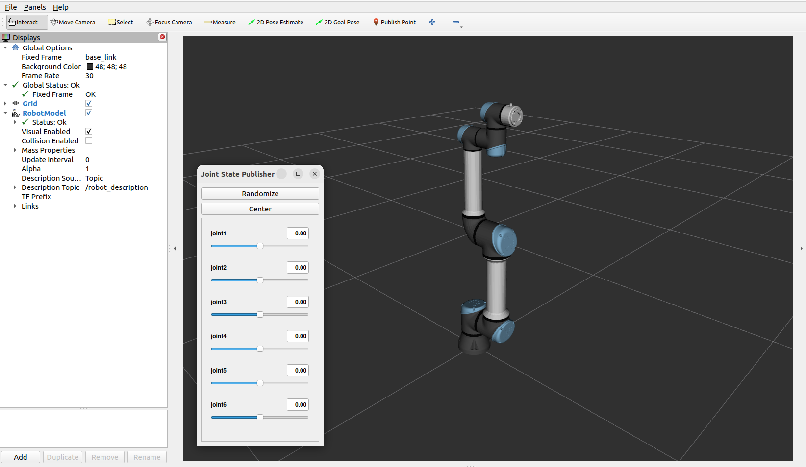

# ROS2 Examples and Code Templates

ROS2 Humble examples with UR5 robot arm.

*Author: Mehmet Kahraman / Date 21.02.2024*

Main Requirements:
--
- Ubuntu 22.04 Jammy
- ROS 2 Humble Desktop

Installed ROS Packages:
--
```
sudo apt install ros-humble-gazebo*
sudo apt install ros-humble-rqt*
sudo apt install ros-humble-moveit*
sudo apt install ros-humble-joint-state-publisher*
sudo apt install ros-humble-launch-param-builder
sudo apt install ros-humble-parameter-traits
sudo apt install ros-humble-ros2-control
sudo apt install ros-humble-ros2-controllers
sudo apt install ros-humble-controller-interface
sudo apt install ros-humble-joint-trajectory-controller
sudo apt install ros-humble-joint-state-broadcaster
sudo apt install ros-humble-gripper-controllers
sudo apt install ros-humble-xacro
sudo apt install ros-humble-realtime-tools
sudo apt install ros-humble-hardware-interface
sudo apt install ros-humble-control-toolbox
sudo apt install ros-humble-filters
sudo apt install ros-humble-ros2bag
sudo apt install ros-humble-plotjuggler*
```

Running Launches and Nodes:
--

Launch example
```
ros2 launch ur5_description display_robot.launch.py
```
Node example
```
ros2 run my_cpp_package publisher_node
```

