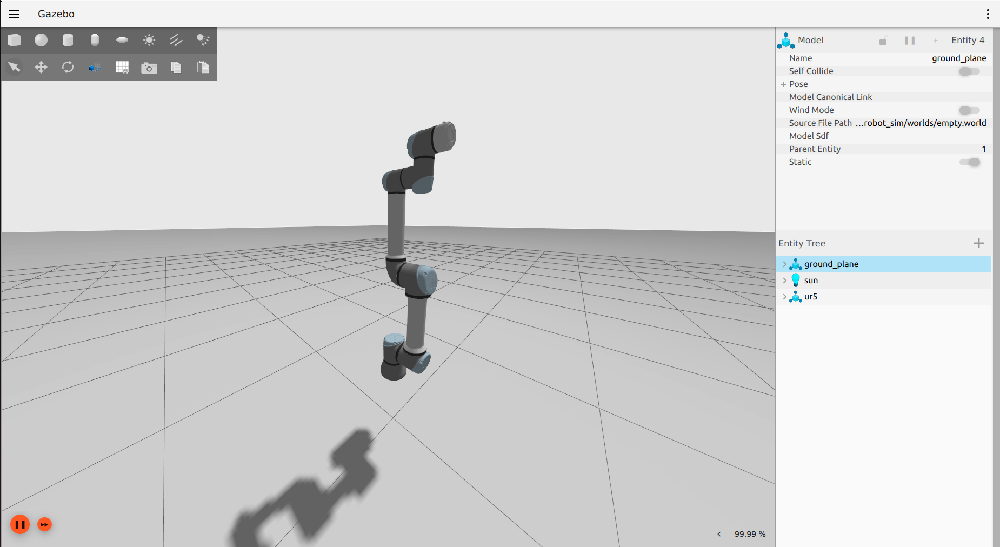

# ROS2 Examples and Code Templates

ROS2 Humble examples with UR5 robot arm.

*Author: Mehmet Kahraman / Date 15.09.2026*

Main Requirements:
--
- Ubuntu 22.04 Jammy
- ROS 2 Humble Desktop
- Ignition Gazebo Fortress

Installation and ROS Packages:
--

Install those ros2 humble packages using apt
```
sudo apt install ros-humble-gz-ros2-control -y
sudo apt install ros-humble-gz-ros2-control-demos -y
sudo apt install ros-humble-ign-ros2-control -y
sudo apt install ros-humble-ros-gz-bridge -y
sudo apt install ros-humble-rqt* -y
sudo apt install ros-humble-joint-state-publisher* -y
sudo apt install ros-humble-launch-param-builder -y
sudo apt install ros-humble-parameter-traits -y
sudo apt install ros-humble-ros2-control -y
sudo apt install ros-humble-ros2-controllers -y
sudo apt install ros-humble-controller-interface -y
sudo apt install ros-humble-joint-trajectory-controller -y
sudo apt install ros-humble-joint-state-broadcaster -y
sudo apt install ros-humble-gripper-controllers -y
sudo apt install ros-humble-xacro -y
sudo apt install ros-humble-realtime-tools -y
sudo apt install ros-humble-hardware-interface -y
sudo apt install ros-humble-control-toolbox -y
sudo apt install ros-humble-filters -y
sudo apt install ros-humble-ros2bag -y
sudo apt install ros-humble-plotjuggler* -y
sudo apt install ros-humble-kdl-parser* -y
```

Clone workspace, build and source it
```
mkdir ros2_examples_ws
cd ros2_examples_ws
mkdir src
cd src
git clone https://github.com/mehmet-engineer/ros2_examples
cd ..
colcon build
source install/setup.bash
```

Running Launches and Nodes:
--

Display robot on RViz
```
ros2 launch ur5_description display_robot.launch.py
```


Node example
```
ros2 run my_cpp_package publisher_node
```

Bringup robot on Gazebo Fortress
```
ros2 launch gazebo_robot_sim bringup_robot.launch.py
```
